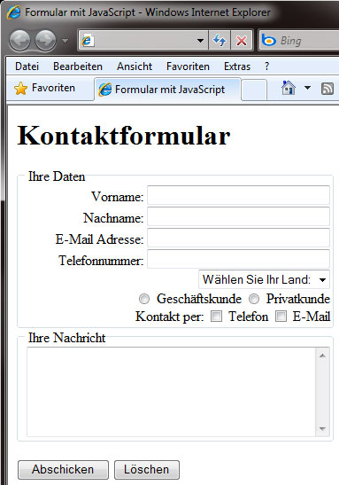
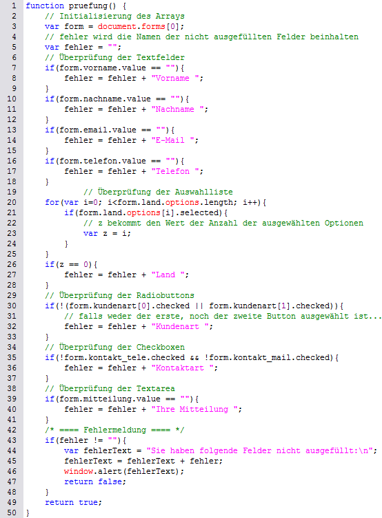

# 7.5.2 Formulare I: Vollständigkeit prüfen

Mit JavaScript können Sie zwar keine Formulare neu erstellen, doch JS kann Formulare verändern oder kontrollieren. Es bringt mehr **Interaktivität in Formulare**. Wenn Sie auf Ihrer Website ein HTML-Formular haben, können Sie mit JavaScript überprüfen lassen, ob die Benutzer ihre Daten korrekt und vollständig eingegeben haben.

Eine Überprüfung des Formulars kann sowohl server- als auch clientseitig erfolgen. Die serverseitige Überprüfung hat zwar den Vorteil, browserübergreifend zu sein, jedoch sind die Interaktivität und die Benutzerfreundlichkeit hier stark eingeschränkt. Daher bietet JavaScript die Möglichkeit, Formulare **clientseitig** zu prüfen. Dabei wird keine neue Browserseite geladen, und der Nutzer kann Fehler direkt korrigieren.

---

## Beispiel: Ein Kontaktformular

<figure>
  
  <figcaption>Ein Kontaktformular</figcaption>
</figure>

Hier sehen Sie ein Formular, das vor allem funktional ist. Laden Sie sich das HTML- und JS-Dokument herunter und öffnen Sie es in Ihrem Editor.

### HTML-Quellcode
;;;html
<!DOCTYPE html>
<html lang="de">
  <head>
    <meta charset="UTF-8">
    <title>Formular mit JavaScript</title>
    
  </head>
  <body>
    <h1>Kontaktformular</h1>
    <form action="daten.html" onsubmit="return pruefung();">
      <fieldset>
        <legend>Ihre Daten</legend>
        Vorname: <input name="vorname" type="text"> 
        Nachname: <input name="nachname" type="text"> 
        E-Mail: <input name="email" type="email"> 
        Telefon: <input name="telefon" type="text"> 
        <select name="land">
          <option>Wählen Sie Ihr Land:</option>
          <option value="Deutschland">Deutschland</option>
          <option value="Österreich">Österreich</option>
          <option value="Schweiz">Schweiz</option>
        </select> 
        <input type="radio" name="kundenart" value="g"> Geschäftskunde
        <input type="radio" name="kundenart" value="p"> Privatkunde 
        Kontakt per:
        <input type="checkbox" name="kontakt_tele"> Telefon
        <input type="checkbox" name="kontakt_mail"> E-Mail 
      </fieldset>
      <fieldset>
        <legend>Ihre Nachricht</legend>
        <textarea name="mitteilung"></textarea>
      </fieldset>
      

        <input type="submit" value="Abschicken">
        <input type="reset" value="Löschen">
      

    </form>
  </body>
</html>
;;;

### JavaScript-Quellcode
;;;javascript
function pruefung() {
  var form = document.forms[0];
  var fehler = "";

  if (form.vorname.value == "") fehler += "Vorname ";
  if (form.nachname.value == "") fehler += "Nachname ";
  if (form.email.value == "") fehler += "E-Mail ";
  if (form.telefon.value == "") fehler += "Telefon ";

  if (form.land.selectedIndex == 0) fehler += "Land ";
  if (!form.kundenart[0].checked && !form.kundenart[1].checked)
    fehler += "Kundenart ";
  if (!form.kontakt_tele.checked && !form.kontakt_mail.checked)
    fehler += "Kontaktart ";
  if (form.mitteilung.value == "") fehler += "Mitteilung ";

  if (fehler != "") {
    alert("Sie haben folgende Felder nicht ausgefüllt:\n" + fehler);
    return false;
  }
  return true;
}
;;;

---

## Arrays zur Datenaufnahme

Formulardaten werden über das Array `document.forms` organisiert. Innerhalb dieses Arrays repräsentiert `forms[0]` das erste Formular. Die darin enthaltenen Elemente werden wiederum im Array `elements` gespeichert.

---

## Warnmeldungen ausgeben

Um Benutzer auf Fehler aufmerksam zu machen, wird eine **Warnmeldung** ausgegeben. Dazu wird eine Variable `fehler` verwendet, die alle nicht ausgefüllten Felder speichert. Diese wird am Ende der Überprüfung angezeigt.

---

<figure>
  
  <figcaption>Quellcode zur vollständigen Überprüfung des Formulars</figcaption>
</figure>
