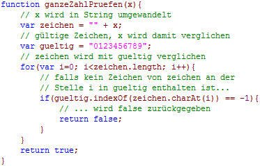
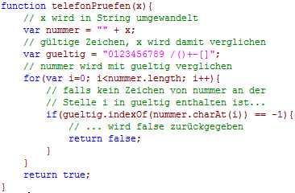
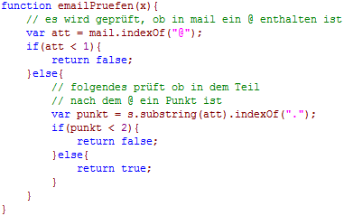

# 7.5.3 Formulare II: Besondere Überprüfungen

Wie ein Formular auf Vollständigkeit überprüft werden kann, wissen Sie nun. Doch ist es oft so, dass bestimmte Formularfelder nicht nur vollständig, sondern auch **korrekt** ausgefüllt werden müssen. So benötigen Telefonnummern nur Zahlen, und E-Mail-Adressen ein **`@`-Zeichen**.

---

## Ganzzahlige Werte (z. B. Postleitzahlen)

JavaScript bietet die Funktion **`isNaN()`**, die überprüft, ob ein Wert keine Zahl ist. In Formularen bei Zahlenangaben sollten Sie jedoch das Gegenteil prüfen.

Hierbei wird der eingegebene Wert als String betrachtet und pro Zeichen überprüft (`charAt(i)`), ob es eine Ziffer zwischen `0` und `9` ist (`indexOf()`).

### Beispiel: Postleitzahlen überprüfen
;;;javascript
if (n.length == 5 && ganzeZahlPruefen(n)) {
  // weitere Anweisungen
}
;;;

<figure>
  
  <figcaption>Überprüfung ganzzahliger Werte</figcaption>
</figure>

---

## Telefonnummern

Zur Überprüfung von Telefonnummern verwenden Sie eine ähnliche Funktion wie bei ganzzahligen Werten. Sie müssen die gültigen Zeichen jedoch um jene erweitern, die in Telefonnummern vorkommen können, z. B. **`+`**, **`-`**, **`()`**.

<figure>
  
  <figcaption>Telefonnummern überprüfen</figcaption>
</figure>

---

## E-Mail-Adressen

Bei der Prüfung von E-Mail-Adressen können Sie nicht auf alle möglichen ungültigen Zeichen prüfen, da es heute eine Vielzahl unterschiedlicher Adressformate gibt. Beschränken Sie sich daher auf die **zwingend erforderlichen Zeichen**: ein **`@`-Zeichen** und einen **Punkt** irgendwann danach.

<figure>
  
  <figcaption>E-Mail-Adressen prüfen</figcaption>
</figure>
