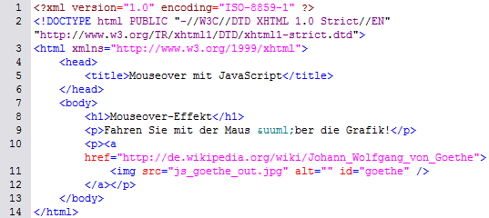
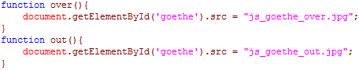
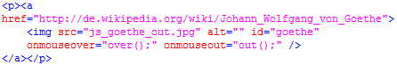
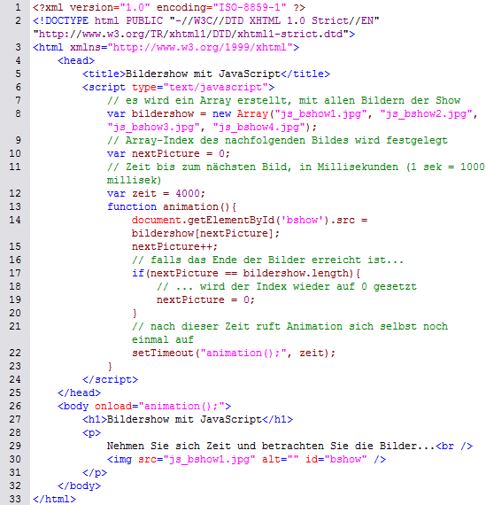

# 7.5.4 Grafiken einsetzen

Mit Grafiken können gerade durch JavaScript sehr schöne Effekte erzeugt werden (z. B. Bildershows). Sicherlich sagt Ihnen der Begriff „Mouseover-Effekt“ etwas.

In JavaScript ist es das Objekt `Image`, mit dem Grafiken verändert oder verschönert werden können. Das `Image`-Objekt arbeitet mit dem Array `document.images` und bietet verschiedene Möglichkeiten, auf Grafiken zuzugreifen:

- `document.nameDerGrafik`
- `document.images[nameDerGrafik]`
- `document.images[nummerDerGrafik]`
- `document.images[#].src` (statt `#` können Sie die Nummer oder den Namen einsetzen)

`nameDerGrafik` ist das `name`-Attribut, das den Grafiken beim Einfügen in den HTML-Sourcecode gegeben werden kann. `nummerDerGrafik` ist die Nummer, die die Grafik im Standard-Array `document.images` besitzt, wobei die Zählung bei `0` beginnt.

Eine weitere wichtige Eigenschaft des Objekts ist `src`, welche die URL der entsprechenden Grafik beschreibt. JavaScript kann diese URL sowohl lesen als auch verändern, sodass z. B. eine neue Grafik geladen wird. Allerdings können nur die Grafik an sich verändert werden, Rahmen und Größe bleiben gleich.

---

## Mouseover erzeugen

Wenn Sie mit der Maus über eine Grafik fahren und sich diese dabei verändert, so ist dieser Effekt mit einem **Mouseover** erzeugt worden. Befindet sich Ihre Maus nicht mehr auf der Grafik, nimmt diese wieder ihre ursprüngliche Gestalt an.

Mit JavaScript können Sie Grafiken zwar nicht verändern, aber austauschen. Dafür erstellen Sie zwei Grafiken, die die gleiche Größe haben, aber unterschiedlich gestaltet sind.

### Beispiel für einen Mouseover-Effekt

<figure>
  
  <figcaption>Beispiel für einen Mouseover-Effekt (HTML-Dokument)</figcaption>
</figure>

Diese Grafik soll beim Darüberfahren ausgetauscht werden. Der dazugehörige JavaScript-Code sieht wie folgt aus:

<figure>
  
  <figcaption>Beispiel für einen Mouseover-Effekt (JavaScript-Code)</figcaption>
</figure>

Der Link im HTML-Code wird entsprechend angepasst, um die Funktionen `onmouseover` und `onmouseout` hinzuzufügen:

<figure>
  
  <figcaption>Veränderung des HTML-Dokuments</figcaption>
</figure>

---

## Animationen und Bildershows

Bildershows wirken, wenn sie klug eingesetzt werden, auf Websites ansprechend und professionell. Bilder wechseln in bestimmten Abständen und starten am Ende wieder von vorne.

### Beispiel: Bildershow mit JavaScript

Der folgende Sourcecode zeigt, wie eine Bildershow in JavaScript realisiert werden kann:

;;;html
<!DOCTYPE html>
<html lang="de">
  <head>
    <title>Bildershow mit JavaScript</title>
    
  </head>
  <body onload="animation();">
    <h1>Bildershow mit JavaScript</h1>
    

      
    

  </body>
</html>
;;;

<figure>
  
  <figcaption>Sourcecode der Bildershow</figcaption>
</figure>

Die Kommentare im Code erklären die meisten Funktionen. Wichtig ist, dass das Attribut `id` in der HTML-Datei und der Bezeichner des `Image`-Objekts gleich sind.

---

## Aufgabe: Spiel erstellen

Erstellen Sie eine Website, die mit dem Besucher interagiert: Eine Grafik ist sichtbar, doch sobald der Benutzer mit der Maus darüber fährt, verschwindet sie und taucht an einer anderen Stelle wieder auf. Verwenden Sie ein ansprechendes Hintergrundbild, um die Seite unterhaltsam zu gestalten.

<figure>
  
  <figcaption>Grafik für die Aufgabe</figcaption>
</figure>
