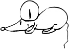

# 7.5.4 Grafiken einsetzen

Mit Grafiken können gerade durch JavaScript sehr schöne Effekte erzeugt werden (z. B. Bildershows). Sicherlich sagt Ihnen der Begriff „Mouseover-Effekt“ etwas.

In JavaScript ist es das Objekt `Image`, mit dem Grafiken verändert oder verschönert werden können. Das `Image`-Objekt arbeitet mit dem Array `document.images` und bietet verschiedene Möglichkeiten, auf Grafiken zuzugreifen:

- `document.nameDerGrafik`
- `document.images[nameDerGrafik]`
- `document.images[nummerDerGrafik]`
- `document.images[#].src` (statt `#` können Sie die Nummer oder den Namen einsetzen)

`nameDerGrafik` ist das `name`-Attribut, das den Grafiken beim Einfügen in den HTML-Sourcecode gegeben werden kann. 

`nummerDerGrafik` ist die Nummer, die die Grafik im Standard-Array `document.images` besitzt, wobei die Zählung bei `0` beginnt.

Eine weitere wichtige Eigenschaft des Objekts ist `src`, welche die URL der entsprechenden Grafik beschreibt. JavaScript kann diese URL sowohl lesen als auch verändern, sodass z. B. eine neue Grafik geladen wird. Allerdings können nur die Grafik an sich verändert werden, Rahmen und Größe bleiben gleich.

---

## Mouseover erzeugen

Wenn Sie mit der Maus über eine Grafik fahren und sich diese dabei verändert, so ist dieser Effekt mit einem **Mouseover** erzeugt worden. Befindet sich Ihre Maus nicht mehr auf der Grafik, nimmt diese wieder ihre ursprüngliche Gestalt an.

Mit JavaScript können Sie Grafiken zwar nicht verändern, aber austauschen. Sie erstellen also zwei Grafiken, die die gleiche Größe haben, nur dass eine Grafik z. B. einen schwarzen, die andere einen grünen Hintergrund hat.

Zum besseren Verständnis ein Sourcecode-Beispiel. Sie sehen in der folgenden Abbildung ein HTML-Dokument, dass in dieser Form nur eine Grafik mit einer Verlinkung ausgibt: 

```html linenums="1" 
<!DOCTYPE html>
<html lang="de">
<head>
  <title>Mouseover mit JavaScript</title>
</head>
<body>
  <h1>Mouseover-Effekt</h1>
  <p>Fahren Sie mit der Maus über die Grafik!</p>
  <p>
    <a href="http://de.wikipedia.org/wiki/Johann_Wolfgang_von_Goethe">
      
    </a>
  </p>
</body>
</html>
```


Diese Grafik soll beim Darüberfahren ausgetauscht werden. Der dazugehörige JavaScript-Code sieht wie folgt aus:

```javascript linenums="1" 
function over() {
  document.getElementById("goethe").src = "../media/js_goethe_over.jpg";
}

function out() {
  document.getElementById("goethe").src = "../media/js_goethe_out.jpg";
}
```
Diese Funktionen betten Sie nun in das Dokument ein. Nun müssen wir sie nur noch auf die Grafik anwenden. Dazu verändern wir den Link wie folgt. Achten Sie darauf, dass die Grafik im HTML-Dokument den gleichen Namen besitzt, wie in Ihren Funktionen. 

Der Link im HTML-Code wird entsprechend angepasst, um die Funktionen `onmouseover` und `onmouseout` hinzuzufügen:

```html linenums="1"
<a href="http://de.wikipedia.org/wiki/Johann_Wolfgang_von_Goethe">
  
</a>
```

Hier haben wir den gesamten Sourcecode und wie es im Browser aussieht.

### Mouseover mit JavaScript

Hier ist der vollständige Sourcecode für den Mouseover-Effekt. Die Grafik ändert sich, wenn Sie die Maus darüber bewegen, und wird zurückgesetzt, wenn Sie die Maus entfernen.

```html linenums="1"
<!DOCTYPE html>
<html lang="de">
<head>
  <title>Mouseover mit JavaScript</title>
  <script>
    function over() {
      document.getElementById("goethe").src = "../media/js_goethe_over.jpg";
    }

    function out() {
      document.getElementById("goethe").src = "../media/js_goethe_out.jpg";
    }
  </script>
</head>
<body>
  <h1>Mouseover-Effekt</h1>
  <p>Fahren Sie mit der Maus über die Grafik!</p>
  <p>
    <a href="http://de.wikipedia.org/wiki/Johann_Wolfgang_von_Goethe">
      
    </a>
  </p>
</body>
</html>
```

### So sieht es im Browser aus

<iframe id="static-preview-frame" 
        style="width: 100%; height: 300px; border: 1px solid #ccc;"
        srcdoc="
<!DOCTYPE html>
<html lang='de'>
<head>
  <title>Mouseover mit JavaScript</title>
  <script>
    function over() {
      document.getElementById('goethe').src = '../media/js_goethe_over.jpg';
    }
    function out() {
      document.getElementById('goethe').src = '../media/js_goethe_out.jpg';
    }
  </script>
</head>
<body>
  <h1>Mouseover-Effekt</h1>
  <p>Fahren Sie mit der Maus über die Grafik!</p>
  <p>
    <a href='http://de.wikipedia.org/wiki/Johann_Wolfgang_von_Goethe'>
      
    </a>
  </p>
</body>
</html>
">
</iframe>


---

## Animationen und Bildershows

Bildershows wirken, klug eingesetzt, auf Websites ansprechend und professionell. Bilder wechseln in bestimmten Abständen und starten am Ende wieder von vorne.

Der folgende Sourcecode zeigt, wie eine Bildershow in JavaScript realisiert werden kann:

```html linenums="1"
<!DOCTYPE html>
<html lang="de">
  <head>
    <title>Bildershow mit JavaScript</title>
    <script type="text/javascript">
      // Pfade der Bilder relativ zu ../media/
      const bildershow = [
        "../media/js_bshow1.jpg", 
        "../media/js_bshow2.jpg", 
        "../media/js_bshow3.jpg", 
        "../media/js_bshow4.jpg"
      ];
      let nextPicture = 0; // Aktuelles Bild
      const zeit = 4000;   // Zeitintervall in Millisekunden

      function animation(){
        document.getElementById("bshow").src = 
          bildershow[nextPicture]; nextPicture++;

        // falls das Ende der Bilder erreicht ist...
        if(nextPicture == bildershow.length){
            // ... wird der Index wieder auf 0 gesetzt
            nextPicture = 0;
        }
        
        // nach dieser Zeit ruft Animation 
        // sich selbst noch einmal auf
        setTimeout("animation();", zeit);
      }
    </script>
  </head>
  <body onload="animation();">
    <h1>Bildershow mit JavaScript</h1>
    <p>
      
    </p>
  </body>
</html>
```

### So sieht es im Browser aus
<iframe id="static-preview-frame2"
        style="width: 100%; height: 450px; border: 1px solid #ccc;"
        srcdoc='
<!DOCTYPE html>
<html lang="de">
  <head>
    <title>Bildershow mit JavaScript</title>
    <script type="text/javascript">
      const bildershow = [
        "../media/js_bshow1.jpg", 
        "../media/js_bshow2.jpg", 
        "../media/js_bshow3.jpg", 
        "../media/js_bshow4.jpg"
      ];
      let nextPicture = 0;
      const zeit = 4000;
      function animation(){
        document.getElementById("bshow").src = bildershow[nextPicture]; nextPicture++;
        // falls das Ende der Bilder erreicht ist...
        if(nextPicture == bildershow.length){
            // ... wird der Index wieder auf 0 gesetzt
            nextPicture = 0;
        }
        // nach dieser Zeit ruft Animation 
        // sich selbst noch einmal auf
        setTimeout("animation();", zeit);
      }
    </script>
  </head>
  <body onload="animation();">
    <h1>Bildershow mit JavaScript</h1>
    <p>
      
    </p>
  </body>
</html>
'></iframe>


Die Kommentare im Code erklären die meisten Funktionen. Wichtig ist, dass das Attribut `id` in der HTML-Datei und der Bezeichner des `Image`-Objekts gleich sind.

---


!!! question "Aufgabe: Spiel erstellen"
    Erstellen Sie eine Website, die mit dem Besucher interagiert: Eine Grafik ist sichtbar, doch sobald der Benutzer mit der Maus darüber fährt, verschwindet sie und taucht an einer anderen Stelle wieder auf. Verwenden Sie ein ansprechendes Hintergrundbild, um die Seite unterhaltsam zu gestalten.

      
    *Grafik für die Aufgabe*

    ??? example "Lösung"
        ```html
        <!DOCTYPE html>
        <html lang="de">
        <head>
          <meta charset="UTF-8">
          <meta name="viewport" content="width=device-width, initial-scale=1.0">
          <title>Maus-Spiel</title>
          <style>
            body {
              background-size: cover;
              margin: 0;
              padding: 0;
              height: 100vh;
              display: flex;
              justify-content: center;
              align-items: center;
            }
            img {
              position: absolute;
              width: 100px;
              cursor: pointer;
            }
          </style>
          <script>
            function moveImage() {
              const image = document.getElementById("spielGrafik");
              const x = Math.random() * (window.innerWidth - 100);
              const y = Math.random() * (window.innerHeight - 100);
              image.style.left = x + "px";
              image.style.top = y + "px";
            }
          </script>
        </head>
        <body>
          
        </body>
        </html>
        ```

### So sieht es im Browser aus

Versuchen Sie die Maus anzuklicken.

<iframe id="static-preview-frame3" 
        style="width: 100%; height: 400px; border: 1px solid #ccc;"
        srcdoc='
<!DOCTYPE html>
<html lang="de">
<head>
  <meta charset="UTF-8">
  <meta name="viewport" content="width=device-width, initial-scale=1.0">
  <title>Maus-Spiel</title>
  <style>
    body {
      background-size: cover;
      margin: 0;
      padding: 0;
      height: 100vh;
      display: flex;
      justify-content: center;
      align-items: center;
    }
    img {
      position: absolute;
      width: 100px;
      cursor: pointer;
    }
  </style>
  <script>
    function moveImage() {
      const image = document.getElementById("spielGrafik");
      const x = Math.random() * (window.innerWidth - 100);
      const y = Math.random() * (window.innerHeight - 100);
      image.style.left = x + "px";
      image.style.top = y + "px";
    }
  </script>
</head>
<body>
  
</body>
</html>
'></iframe>